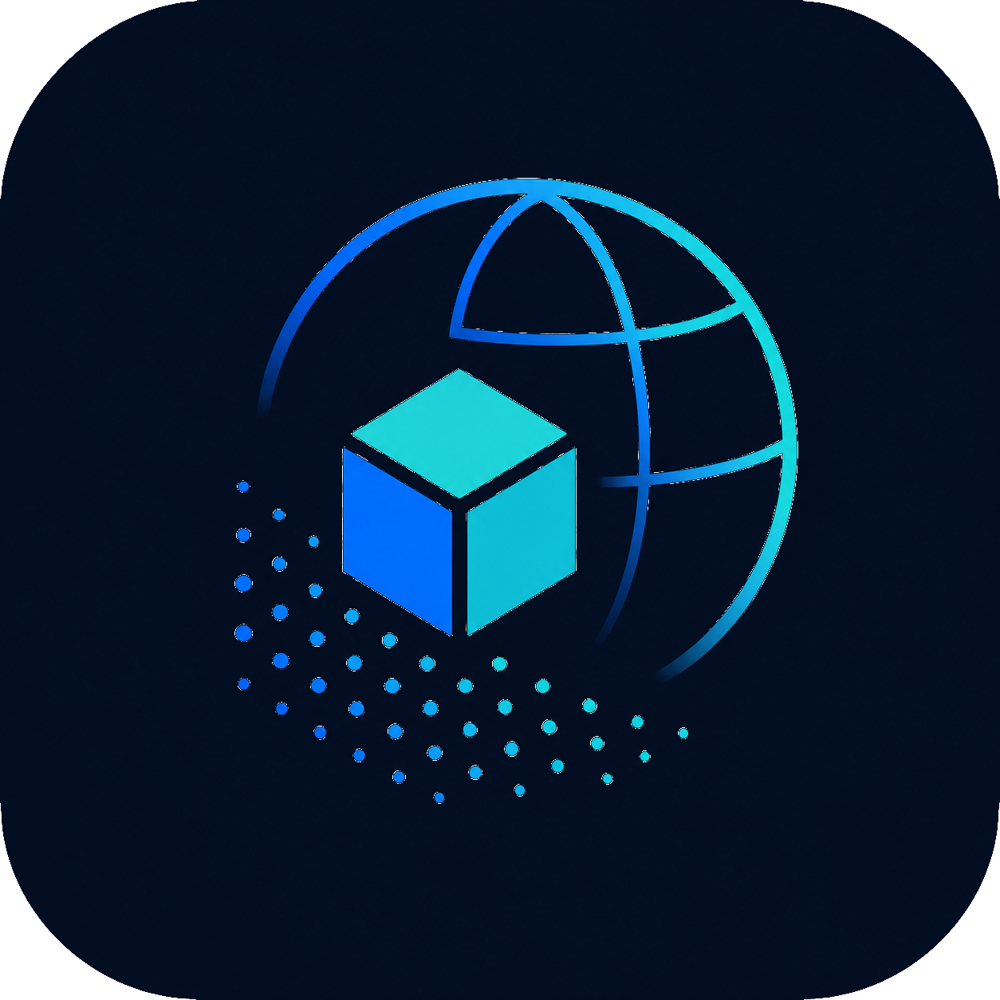

<p align="center">
  
</p>

# [copcesium](https://github.com/Jangmyun/copcesium) &middot; [](https://www.npmjs.com/package/copcesium) [](https://github.com/Jangmyun/copcesium/actions/workflows/ci.yml) [](https://github.com/Jangmyun/copcesium/actions/workflows/publish.yml) [](https://github.com/Jangmyun/copcesium/blob/main/LICENSE) [](https://github.com/Jangmyun/copcesium/issues)

[English README](./README.md)

[COPC](https://copc.io/)(Cloud Optimized Point Cloud)를 CesiumJS에서 실시간으로 스트리밍·렌더링하는 라이브러리입니다.

- **로드가 아니라 스트리밍:** 현재 카메라에 보이는 옥트리 노드만 HTTP Range Request로 가져옵니다 — 파일 전체를 내려받지 않습니다.
- **메인 스레드 밖에서 디코딩:** LAZ 압축 해제와 좌표 변환은 재사용되는 Web Worker 풀에서 실행되어, 디코딩이 UI를 막지 않습니다.
- **LoD(Level of Detail):** 화면 공간 오차(screen-space error) 기준으로 옥트리를 순회해 세분화 여부를 결정하므로, 점 밀도가 실제 카메라 해상도에 맞춰집니다. 탈락한 노드는 대체 노드(자식 또는 부모)가 실제로 보여줄 준비가 됐을 때만 교체되어, 전환 중간에 빈 공간이 보이는 순간이 없습니다.
- **CRS 인식:** 파일 자체의 WKT 메타데이터에서 원본 좌표계를 자동 감지합니다(수직 단위가 미터가 아닌 복합 CRS 포함). proj4 기반 EPSG 폴백 테이블도 내장.
- **실시간 조정:** `pixelSize`, `sseThreshold`, 그리고 [스타일링 API](#스타일링) 전체를 실행 중인 데이터소스에서 재로드 없이 바로 조정할 수 있습니다.
- **진짜 plug-and-play:** 배포된 패키지는 자기 완결적인 `.mjs` 파일 하나입니다 — Worker와 `laz-perf` WASM 모듈이 빌드 시점에 완전히 인라인되어, 번들러가 놓칠 수 있는 별도 에셋이 없습니다.

> 📖 **자세한 문서는 [위키](https://github.com/Jangmyun/copcesium/wiki)에 있습니다:** [Architecture](https://github.com/Jangmyun/copcesium/wiki/Architecture) · [Options & Tuning](https://github.com/Jangmyun/copcesium/wiki/Options-and-Tuning) · [Coordinate Systems](https://github.com/Jangmyun/copcesium/wiki/Coordinate-Systems) · [Converting to COPC](https://github.com/Jangmyun/copcesium/wiki/Converting-to-COPC) · [Troubleshooting](https://github.com/Jangmyun/copcesium/wiki/Troubleshooting). (위키는 영어로 제공됩니다.) 이 README는 빠른 참조용입니다.

## 목차

- [설치](#설치)
- [빠른 시작](#빠른-시작)
- [옵션](#옵션)
- [API 레퍼런스](#api-레퍼런스)
- [요구사항: HTTP Range Request와 CORS](#요구사항-http-range-request와-cors)
- [좌표계](#좌표계)
- [예제](#예제)
- [Credits](#credits)
- [라이선스](#라이선스)

## 설치

```bash
npm install copcesium cesium
```

`cesium`은 peer dependency(`>=1.100.0`)입니다 — 이미 프로젝트에서 쓰고 있는 버전을 그대로 설치하면 됩니다. copcesium은 **ESM 전용**입니다(CommonJS 빌드 없음). Worker와 `laz-perf` WASM이 빌드 시점에 단일 `.mjs`로 인라인되는데, 이때 `require()`가 제공하지 못하는 `import.meta.url` 시맨틱이 필요하기 때문입니다.

## 빠른 시작

```ts
import * as Cesium from 'cesium';
import { CopcDataSource } from 'copcesium';

const viewer = new Cesium.Viewer('cesiumContainer');

const dataSource = await CopcDataSource.load(
  'https://s3.amazonaws.com/hobu-lidar/autzen-classified.copc.laz',
  viewer,
);
```

이게 전부입니다 — `load()`가 COPC 계층 구조를 가져오고, 파일의 WKT가 있으면 원본 좌표계를 자동 감지하고, 카메라를 데이터셋 위치로 이동시킨 뒤, 카메라가 움직이는 대로 노드를 스트리밍하기 시작합니다. URL 입력창, 실시간 `pixelSize`/`sseThreshold` 슬라이더, 에러 처리까지 포함된 조금 더 완전한 예제는 [`examples/basic-viewer/main.ts`](./examples/basic-viewer/main.ts)를 참고하세요.

파일의 WKT가 좌표계를 완전히 설명하지 못하거나 아예 없다면, 직접 지정할 수 있습니다:

```ts
const dataSource = await CopcDataSource.load(url, viewer, {
  proj: 'EPSG:2992',
  projDef:
    '+proj=lcc +lat_1=43 +lat_2=45.5 +lat_0=41.75 +lon_0=-120.5' +
    ' +x_0=399999.9999999999 +y_0=0 +datum=NAD83 +units=ft +no_defs',
  geoidOffset: -20, // 미터 단위, 이 지점의 로컬 지오이드와 WGS84 타원체 간 차이
});
```

데이터소스를 다 쓰고 나면:

```ts
dataSource.destroy();
```

## 옵션

`CopcDataSource.load()`의 세 번째 인자는 모든 필드가 선택 사항입니다.

```ts
interface CopcDataSourceOptions {
  proj?: string;
  projDef?: string | null;
  geoidOffset?: number;
  concurrency?: number;
  debounceMs?: number;
  maxCacheNodes?: number;
  maxCacheBytes?: number;
  maxVisibleNodes?: number;
  maxPoints?: number;
  pixelSize?: number;
  sseThreshold?: number;
  zFactor?: number;
  xyFactor?: number;
  autoFrame?: boolean;
  colorMode?: 'rgb' | 'intensity' | 'classification' | 'elevation';
  classificationFilter?: number[];
  intensityRange?: [number, number];
}
```

| 옵션 | 기본값 | 설명 |
| --- | --- | --- |
| `proj` | `'EPSG:4326'` | 원본 CRS 식별자. 생략 시 파일 WKT에서 자동 감지. |
| `projDef` | `null` | `proj`에 대한 proj4 정의 문자열 — proj4가 해당 CRS를 이미 알고 있지 않을 때만 필요. |
| `geoidOffset` | `0` | 모든 점의 높이에 더할 미터 값 — 파일의 수직 기준면이 이미 타원체 기준이 아니라면, 그 지점의 로컬 지오이드와 WGS84 타원체 간 차이. |
| `zFactor` | 자동 감지 | 파일의 Z 단위를 미터로 변환하는 계수. `proj`/`projDef`를 직접 지정해도, WKT에 수직 단위 정보가 있으면 감지됩니다. |
| `xyFactor` | 자동 감지 | 파일의 XY 단위를 미터로 변환하는 계수(bounding sphere 크기 계산에 사용). |
| `concurrency` | `5` | 노드를 병렬로 디코딩하는 Worker 스레드 개수. `load()`에 `workerPool`을 넘기면 무시됨. |
| `debounceMs` | `100` | 전체 LoD 재선택 패스 사이의 최소 간격. 더 가벼운 frustum 전용 가시성 체크는 매 프레임 계속 돕니다. |
| `maxCacheNodes` | `150` | 메모리에 유지하는 최대 노드 수(LRU) — 초과하면 선택되지 않은 것 중 가장 오래 안 쓰인 노드부터 정리됩니다. |
| `maxCacheBytes` | 없음 | `maxCacheNodes`에 더해 적용되는 메모리 상한(추정 바이트) — 둘 중 먼저 초과하는 쪽으로 축출합니다. 노드당 `pointCount * 21`(고정된 포인트당 버퍼 레이아웃)로 추정됩니다. 데이터셋마다 적절한 노드당 포인트 수가 달라 기본값은 없습니다. |
| `maxVisibleNodes` | `100` | 한 번의 LoD 패스에서 렌더링용으로 선택하는 최대 노드 수. |
| `maxPoints` | `5,000,000` | 한 번의 LoD 패스에서 선택된 노드들의 총 포인트 수 상한 — `maxVisibleNodes`와 함께 적용됩니다. |
| `pixelSize` | `2` | 포인트 크기(픽셀). 로드 후 `dataSource.pixelSize`로 실시간 조정 가능. |
| `sseThreshold` | `250` | 이 값을 넘으면 노드를 자식으로 세분화하는 화면 공간 오차(픽셀) 기준값. 낮을수록 디테일은 높아지고 로드되는 노드도 많아집니다. `dataSource.sseThreshold`로 실시간 조정 가능. |
| `autoFrame` | `true` | `load()`가 resolve되기 전에 카메라를 데이터셋으로 비행시킬지 여부. 카메라를 직접 관리한다면 `false`로 설정하세요. |
| `colorMode` | `'rgb'` | 포인트 색상 기준. `dataSource.colorMode`로 실시간 조정 가능. [스타일링](#스타일링) 참고. |
| `classificationFilter` | 전체 | 그릴 LAS 분류 코드 목록. 나머지는 그리지 않습니다. `dataSource.classificationFilter`로 실시간 조정 가능. |
| `intensityRange` | 자동 | `'intensity'` 램프의 양 끝에 대응하는 원시 intensity 값. 생략하면 노드가 로드될 때마다 `[0, 지금까지 본 최댓값]`으로 넓어집니다. |

## API 레퍼런스

### `CopcDataSource.load(url, viewer, options?, workerPool?): Promise<CopcDataSource>`

정적 팩토리 메서드입니다 — `CopcDataSource`는 공개 생성자가 없습니다. 계층 구조 로드가 끝나면(그리고 `autoFrame`이 켜져 있으면 카메라 비행까지 끝나면) resolve됩니다.

- `url: string` — `.copc.laz` 파일 URL. HTTP Range Request를 지원해야 합니다(아래 참고).
- `viewer: Cesium.Viewer`
- `options?: CopcDataSourceOptions` — [옵션](#옵션) 참고.
- `workerPool?: WorkerPool` — 데이터소스 간 풀 재사용을 위한 예약 인자이지만, 아직 패키지 밖에서는 사용할 수 없습니다([이슈 #51](https://github.com/Jangmyun/copcesium/issues/51)). 넘기지 마세요 — `load()`마다 `concurrency` 크기의 자체 풀을 받습니다.

### 인스턴스 멤버

```ts
class CopcDataSource {
  pixelSize: number;
  sseThreshold: number;
  colorMode: ColorMode;
  classificationFilter: number[] | undefined;
  intensityRange: [number, number];
  readonly maxDepth: number;
  readonly nodeCount: number;
  readonly cacheSize: number;
  zoomTo(): Promise<void>;
  destroy(): void;
}
```

| 멤버 | 설명 |
| --- | --- |
| `pixelSize` | get/set. 현재 렌더링 중인 모든 노드의 포인트 크기를 재로드 없이 즉시 갱신합니다. |
| `sseThreshold` | get/set. 값을 설정하면 즉시 LoD 재선택 패스가 실행됩니다. |
| `colorMode` | get/set. 다음 프레임에 로드된 모든 노드가 다시 칠해집니다 — 재요청도 재디코딩도 없습니다. |
| `classificationFilter` | get/set. `undefined`를 넣으면 다시 전부 그립니다. 0-255 범위를 벗어난 값에는 `RangeError`를 던집니다. |
| `intensityRange` | get/set. `undefined`를 넣으면 다시 자동 범위로 돌아갑니다. |
| `maxDepth` | 읽기 전용. 로드된 계층 구조에 존재하는 가장 깊은 옥트리 레벨. |
| `nodeCount` | 읽기 전용. 계층 구조 내 전체 노드 수(로드 여부 무관). |
| `cacheSize` | 읽기 전용. LRU 캐시에 현재 남아있는 노드 수. |
| `zoomTo()` | 카메라를 데이터셋의 루트 bounding sphere로 비행시킵니다. `autoFrame`이 켜져 있으면 `load()`가 내부적으로 호출하며, 나중에 다시 프레이밍하고 싶으면 직접 호출하면 됩니다. |
| `destroy()` | Worker 풀(외부에서 주입된 게 아니라면)과 노드 캐시, 로드된 모든 프리미티브를 정리합니다. 여러 번 호출해도 안전합니다. |

## 스타일링

모든 포인트는 색상, 원시 intensity, 분류, 정규화된 고도를 함께 GPU로 올리고, 색상 결정은 vertex 셰이더에서 합니다. 따라서 모드나 필터를 바꾸는 것은 uniform 갱신 하나입니다 — HTTP 요청도, LAZ 디코딩도 없고, 노드 캐시도 그대로입니다.

```ts
const ds = await CopcDataSource.load(url, viewer);

ds.colorMode = 'classification';   // 'rgb' | 'intensity' | 'classification' | 'elevation'
ds.classificationFilter = [2, 6];  // 지면과 건물만 그리기
ds.classificationFilter = undefined; // ...다시 전부 그리기
```

| 모드 | 색상 기준 |
| --- | --- |
| `'rgb'` | 파일이 가진 Red/Green/Blue. 색상이 없는 파일에서는 포인트별로 분류 팔레트 → 회색 순으로 대체합니다. |
| `'intensity'` | `intensityRange` 구간의 그레이스케일. |
| `'classification'` | 아래 ASPRS 팔레트를 무조건 적용합니다 — `'rgb'`의 대체 경로와 달리, 색상이 **있는** 파일에서도 동작합니다. |
| `'elevation'` | 파일 헤더의 전체 Z 범위에 대해 파랑 → 청록 → 초록 → 노랑 → 빨강. |

분류 팔레트는 아래 ASPRS 코드를 다루고, 그 외 코드는 밝은 회색으로 그립니다.

| 코드 | 분류 | 코드 | 분류 |
| --- | --- | --- | --- |
| 2 | Ground | 9 | Water |
| 3 | Low Vegetation | 10 | Rail |
| 4 | Medium Vegetation | 11 | Road Surface |
| 5 | High Vegetation | | |
| 6 | Building | | |

필터로 걸러진 포인트는 vertex 셰이더에서 버려집니다. 즉 필터링은 포인트를 **숨기는** 것이지 GPU 메모리를 회수하는 게 아닙니다.

## 요구사항: HTTP Range Request와 CORS

copcesium은 필요한 바이트만(COPC 헤더, 계층 구조 페이지, 개별 노드의 포인트 데이터) HTTP Range Request로 가져오며, 파일 전체를 받지 않습니다. `.copc.laz` 파일을 어디에 호스팅하든, 서버는 다음을 지원해야 합니다:

- `Range` 요청 헤더를 지원하고 `206 Partial Content`로 응답 (Amazon S3, 대부분의 정적 호스팅·CDN은 기본 지원).
- CORS 헤더(`Access-Control-Allow-Origin`)로 앱의 origin을 허용 — 파일이 앱과 같은 origin에서 서빙되는 게 아니라면 이 요청들은 cross-origin `fetch()`이기 때문입니다.

CORS, Range Request, 좌표가 엉뚱한 위치에 찍히는 문제는 [Troubleshooting](https://github.com/Jangmyun/copcesium/wiki/Troubleshooting) 위키 페이지를 참고하세요.

## 좌표계

`CopcDataSource`는 COPC 파일의 WKT VLR이 있으면 원본 CRS와 단위 변환 계수를 자동 감지합니다 — 수평/수직이 따로 정의된 복합 CRS(예: feet 단위 State Plane + NAVD88 수직 기준면)도 포함합니다. 자동 감지가 실패하거나 직접 오버라이드해야 한다면 `proj`/`projDef`를 명시적으로 넘기면 됩니다([옵션](#옵션) 참고).

감지 흐름, proj4 폴백 테이블, 수직 단위(`zFactor`) 처리, 좌표 디버깅 체크리스트 등 자세한 내용은 [Coordinate Systems](https://github.com/Jangmyun/copcesium/wiki/Coordinate-Systems) 위키 페이지에 있습니다.

## 예제

[`examples/basic-viewer`](./examples/basic-viewer)는 이 저장소의 `src/`가 아니라 npm 레지스트리에서 `copcesium`을 설치해 쓰는 최소한의 독립 프로젝트입니다 — URL 입력창, `pixelSize`/`sseThreshold` 슬라이더, `colorMode` 선택 박스, 분류별 필터 체크박스, "Remove & reload" 버튼, 화면에 표시되는 에러 영역이 있습니다. 공개 샘플 데이터셋([Autzen Stadium](https://github.com/PDAL/data/tree/main/autzen))을 자동으로 로드합니다.

copcesium은 프레임워크에 종속되지 않지만, Cesium 사용의 상당수는 React를 통해 이루어집니다 — 아래 두 예제가 그 통합 방식을 보여줍니다:

- [`examples/react/react-viewer`](./examples/react/react-viewer) — 같은 최소 구성의 뷰어를 순수 React 컴포넌트(`useRef`/`useEffect`, 별도 래퍼 라이브러리 없음)로 구현한 예제.
- [`examples/react/react-resium-viewer`](./examples/react/react-resium-viewer) — [resium](https://resium.reearth.io/) 기반의 스타일링된 사이드바 뷰어로, resium의 `useCesium()` 훅을 통해 `copcesium`의 명령형 API에 접근합니다.

```bash
git clone https://github.com/Jangmyun/copcesium.git
cd copcesium/examples/basic-viewer
npm install
cp .env.example .env   # 필요하면 VITE_CESIUM_TOKEN에 본인의 Cesium Ion access token 추가
npm run dev
```

터미널에 출력되는 로컬 URL을 브라우저로 열면 됩니다. `examples/` 아래의 각 예제는 모두 같은 방식으로 실행합니다 — 각 디렉터리에서 `npm install && npm run dev`.

## 기여하기

기여를 환영합니다 — 빌드·테스트·PR 제출 방법은 [CONTRIBUTING.md](./CONTRIBUTING.md)를 참고하세요. 이 프로젝트는 [행동 강령](./CODE_OF_CONDUCT.md)을 따릅니다. 보안 취약점 신고는 [SECURITY.md](./SECURITY.md)를 참고하세요.

## Credits

- [`copc`](https://github.com/connormanning/copc.js) — COPC 파싱(헤더/계층 구조/포인트 데이터, HTTP Range Request 기반)
- [`laz-perf`](https://github.com/hobuinc/laz-perf) — WASM 기반 LAZ 압축 해제
- [`proj4`](https://github.com/proj4js/proj4js) — 좌표계 변환
- [CesiumJS](https://cesium.com/platform/cesiumjs/) — 3D 지구본 렌더링

## 라이선스

copcesium은 [MIT 라이선스](./LICENSE)를 따릅니다. 배포 빌드에 번들되는 서드파티 오픈소스의 라이선스·고지는 [THIRD_PARTY_LICENSES.md](./THIRD_PARTY_LICENSES.md)에 정리돼 있습니다. 릴리스 이력은 [CHANGELOG.md](./CHANGELOG.md)를 참고하세요.
